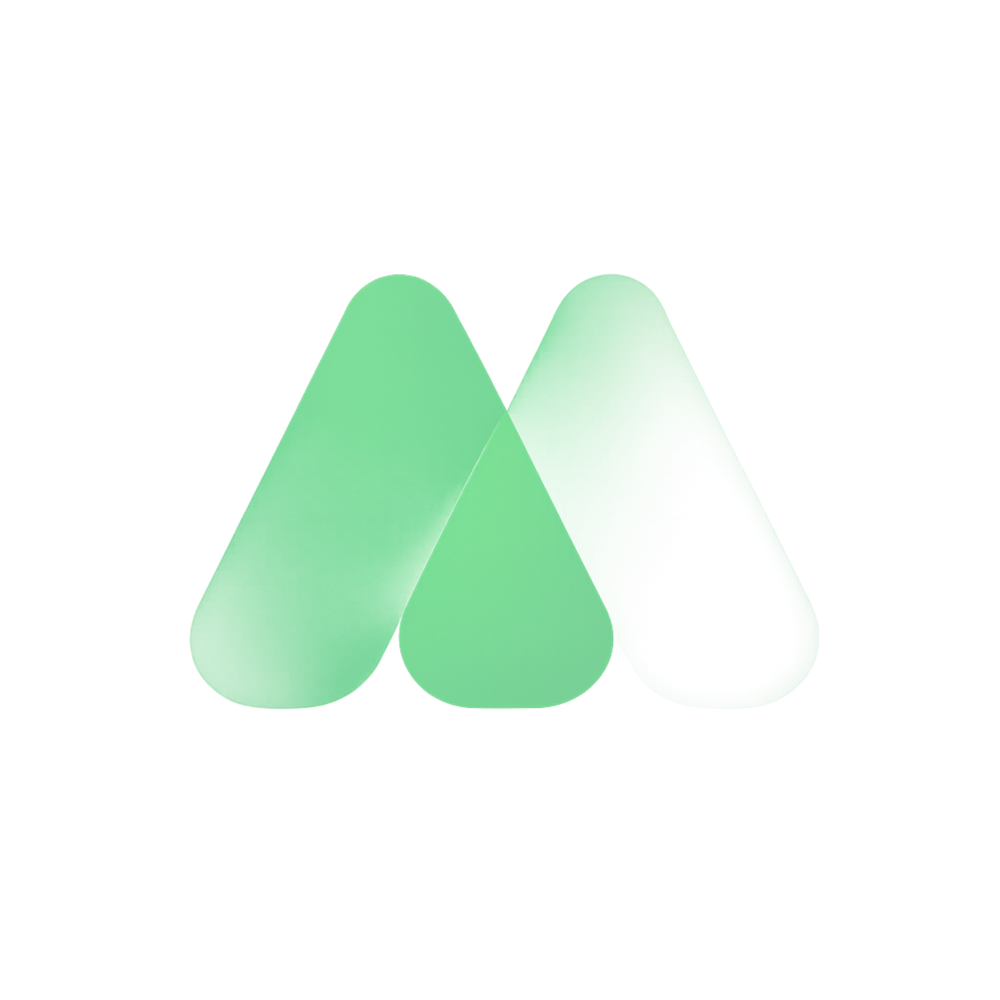
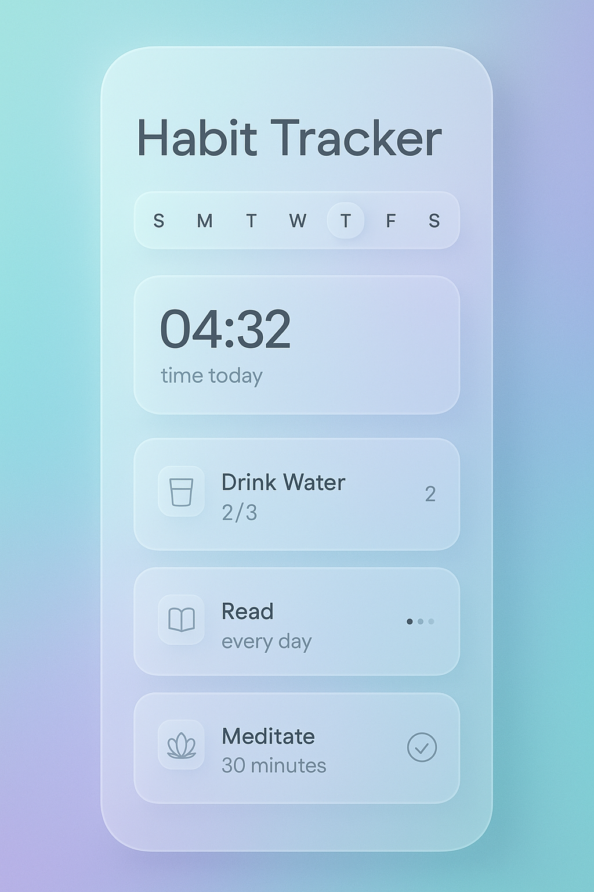
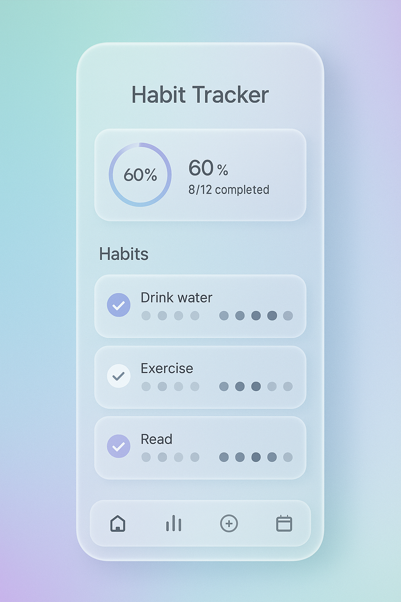
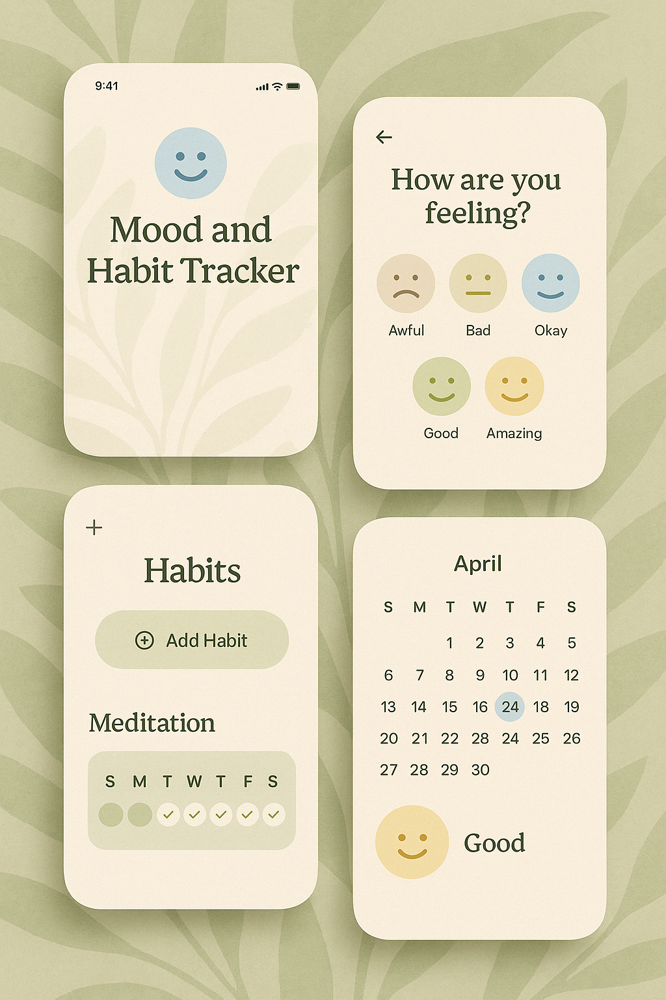
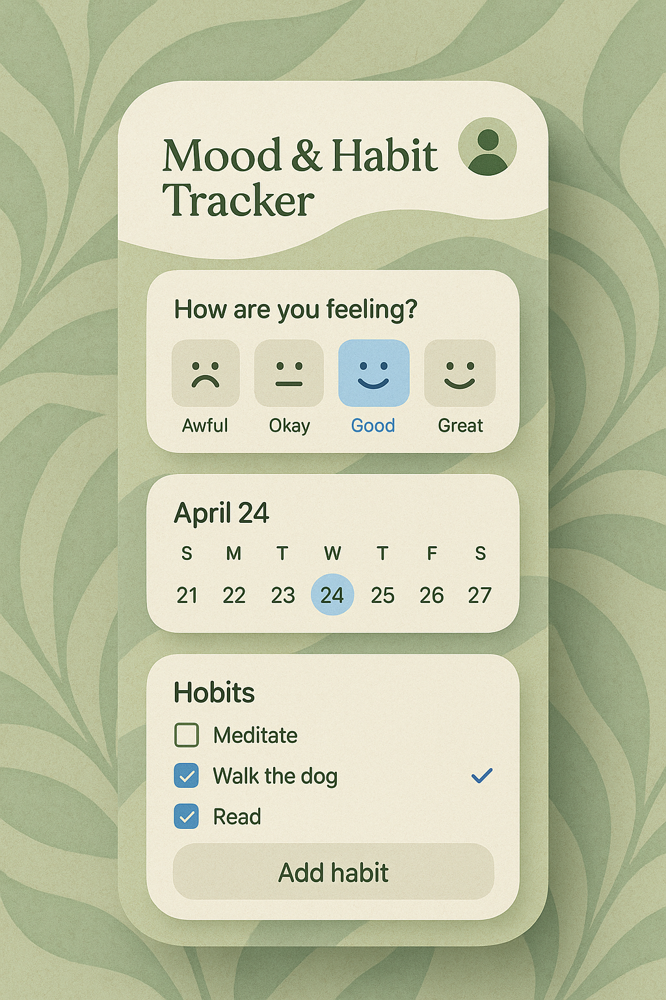
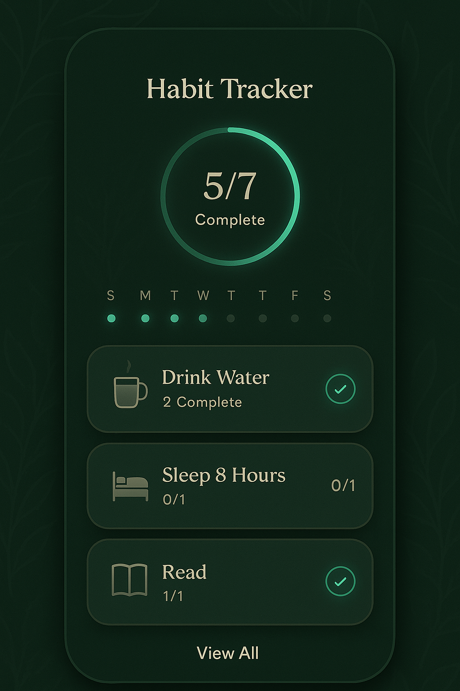
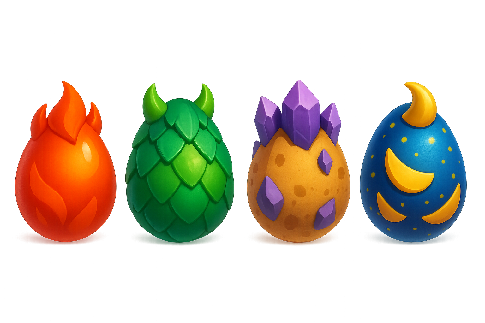

# 🌟 Mira — Circadian Life & Habit Intelligence System

<div align="center">

  

  <h3>Harmonize your daily life with your biological clock and AI.</h3>

  <p>
    A production-grade, offline-first personal wellness & habit management ecosystem built with <b>Flutter</b>, <b>Clean Architecture</b>, and <b>AI-driven Circadian Rhythm Intelligence</b>.
  </p>

  <p>
    <a href="#-key-features">Key Features</a> •
    <a href="#-architecture--tech-stack">Architecture</a> •
    <a href="#-engineering-highlights">Engineering Highlights</a> •
    <a href="#-getting-started">Getting Started</a> •
    <a href="#-testing--code-quality">Testing & Quality</a>
  </p>

  <p>
    
    
    
    
    
    
    
  </p>

</div>

---

## 📱 Visual Showcase

<div align="center">
  <table>
    <tr>
      <td align="center" width="33%">
        <br/>
        <b>🧬 Circadian Habit Management</b>
      </td>
      <td align="center" width="33%">
        <br/>
        <b>✨ Minimalist Daily Schedule</b>
      </td>
      <td align="center" width="33%">
        <br/>
        <b>📊 Live Energy & Mood Analytics</b>
      </td>
    </tr>
    <tr>
      <td align="center" width="33%">
        <br/>
        <b>🛡️ Goal & Streak Intelligence</b>
      </td>
      <td align="center" width="33%">
        <br/>
        <b>🌱 Theme Variations Engine</b>
      </td>
      <td align="center" width="33%">
        <br/>
        <b>🎮 Anti-Cheat Gamification</b>
      </td>
    </tr>
  </table>
</div>

---

## ✨ Key Features

- **🧬 Circadian Rhythm (Biorhythm) Intelligence:** Calculates dynamic daily energy windows (`Focus`, `Energy`, `Light`, `Reflection`) tailored to individual biological clocks.
- **🤖 Groq Llama 3.3 Onboarding Guide:** Conversational, empathetic AI questionnaire determining user archetype and tailoring custom habit routines.
- **🛡️ Advanced Habit Tracker:** Supports yes/no, numeric progress, custom drag-to-set streaks, subtasks, frequency schedules (specific weekdays, periodic intervals), and time-based goals.
- **🎨 Infinite Vision Board:** Interactive drag-and-drop canvas linking visual dreams directly to daily executable habits.
- **⏱️ Multimodal Focus Timer:** Pomodoro, Countdown, Stopwatch, Hourglass, and Football Stopwatch themes with background execution support (`flutter_background_service`).
- **👥 Social Circles & Hub:** Real-time room competitions, leaderboards, and collaborative habit progress powered by Cloud Firestore.
- **🎮 Anti-Cheat Gamification:** Streak protection mechanics ("Ice" freeze shields, verification taps, cheat-proof timestamp validation).
- **💳 StoreKit & Google Play Billing:** In-App Purchase and entitlement management for Mira Plus with free-trial logic.
- **📱 Home Screen Widget:** Android & iOS home screen widgets displaying daily progress using `home_widget`.
- **🌍 Scalable Localization:** Full native support for 15+ languages including Turkish, English, German, French, Japanese, Arabic, and Spanish.

---

## 🏗️ Architecture & Tech Stack

Mira is structured according to **Feature-First Clean Architecture** principles, prioritizing modularity, maintainability, and testability.

```
lib/
├── config/              # App configuration, routes, environment definitions
├── core/                # Core helpers, shared constants, API configurations
├── design_system/       # Atomic UI components, tokens, pastel theme variations
├── features/            # Feature-driven modular domain slices
│   ├── habit/           # Domain models, repositories, interactive cards & wizard
│   ├── rhythm/          # Circadian rhythm mathematical analyzer & models
│   ├── vision/          # Freeform canvas, draggable text & sticker repositories
│   ├── timer/           # Foreground/background animated timers & dashboard cards
│   ├── mood/            # Emotional timeline, mood statistics & repositories
│   ├── social/          # Room member models, leaderboard & Firestore streams
│   ├── gamification/    # XP, level progression & anti-cheat validator
│   ├── onboarding/      # Conversational AI guide & archetype profiling
│   ├── profile/         # Account management, backup & security settings
│   └── schedule/        # Weekly calendar projection models
├── l10n/                # 15 ARB localization bundles and generated delegates
├── models/              # Core DTOs and cross-feature domain entities
├── providers/           # State management via Provider
├── services/            # In-App Purchase, AdMob, Groq AI, Widgets, Local Storage
└── main.dart            # Application entrypoint & initialization orchestration
```

### 🧰 Technology Matrix

| Layer | Technologies / Packages |
|---|---|
| **Framework** | [Flutter](https://flutter.dev/) (SDK ^3.5.0, Dart ^3.5.0) |
| **State Management** | [Provider](https://pub.dev/packages/provider) |
| **Local Storage** | `shared_preferences`, `flutter_secure_storage` |
| **Cloud & Backend** | `firebase_core`, `firebase_auth`, `cloud_firestore` |
| **AI Integration** | Groq Llama-3.3-70B & Llama-3.1-8B API |
| **Monetization** | `in_app_purchase`, `google_mobile_ads` |
| **Background & OS** | `flutter_background_service`, `flutter_local_notifications`, `home_widget` |
| **Graphics & Motion** | `lottie`, `fl_chart`, `flutter_staggered_animations` |
| **Quality & Tests** | `flutter_test`, `mocktail`, `flutter_lints` |

---

## ⚡ Engineering Highlights

### 1. 🛡️ Anti-Cheat & Streak Mathematical Integrity
Habit streaks and gamification XP are protected against client-side system clock manipulation. Completion recalculations verify historical timestamp continuity and implement "Ice Shield" tap-challenge mechanisms before breaking or continuing streaks.

### 2. 🧬 Circadian Biorhythm Scheduling
Instead of rigid time-of-day reminders, habits can bind directly to calculated **Circadian Windows** (`Focus`, `Energy`, `Light`, `Reflection`), recalculating optimum performance slots based on sleep-wake cycles.

### 3. 🔒 Zero-Leak Security Protocol
All third-party AI keys and production identifiers are decoupled from version control. Sensitive configurations are injected at compile time via `--dart-define` parameters, preventing secrets from leaking into public repositories.

---

## 🧪 Testing & Code Quality

Code quality is enforced via automated CI/CD pipelines on every Pull Request and branch push:

- **Static Analysis:** `flutter analyze` passes with **0 warnings / 0 errors**.
- **Automated Tests:** 100% pass rate across Unit & Widget test suites (Anti-cheat, Recalculation, Mocked Provider states).

To run verification locally:

```bash
# Run static analysis
flutter analyze

# Run all test suites
flutter test
```

---

## 🚀 Getting Started

### Prerequisites
- [Flutter SDK](https://docs.flutter.dev/get-started/install) (`>= 3.5.0`)
- [Dart SDK](https://dart.dev/get-dart) (`>= 3.5.0`)
- Android Studio / Xcode for emulator or physical device execution

### 1. Clone the Repository
```bash
git clone https://github.com/furkankisisel/mira.git
cd mira
```

### 2. Install Dependencies
```bash
flutter pub get
```

### 3. Configure Environment Variables
Pass your optional Groq AI key at runtime or compile time:

```bash
flutter run --dart-define=GROQ_API_KEY=your_groq_api_key_here
```

*(Note: Firebase and Google Services configurations can be initialized using the standard `flutterfire configure` command).*

---

## 👥 Contributing & PR Process

Contributions, issues, and feature suggestions are welcome!
1. Fork the project
2. Create your Feature Branch (`git checkout -b feature/AmazingFeature`)
3. Commit your Changes (`git commit -m 'feat: Add some AmazingFeature'`)
4. Push to the Branch (`git push origin feature/AmazingFeature`)
5. Open a Pull Request (using our PR template)

---

## 📄 License

This project is licensed under the MIT License — see the [LICENSE](LICENSE) file for details.

<div align="center">
  <sub>Crafted with passion by <b>Furkan Kişisel</b> • Designed for human wellness & potential.</sub>
</div>
